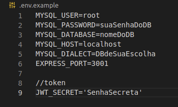
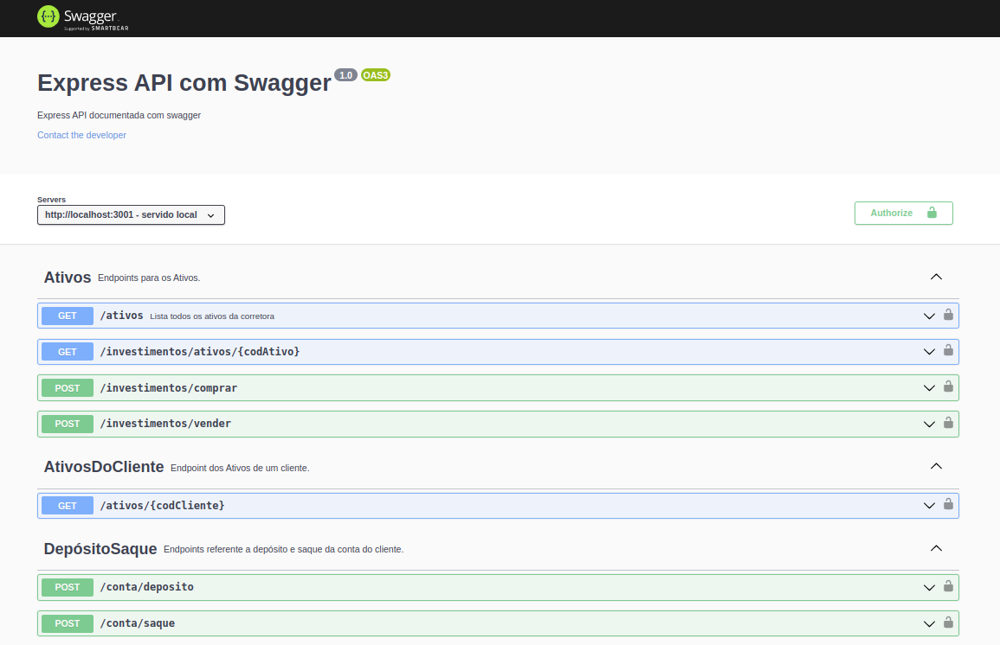

# `BEM-VINDOOO AO: Desafio Técnico da Turma XP-Trybe! 🚀🚀 (BackEnd) 🚀🚀`

# `Sumário`

- [`BEM-VINDOOO AO: Desafio Técnico da Turma XP-Trybe! 🚀🚀 (BackEnd) 🚀🚀`](#bem-vindooo-ao-desafio-técnico-da-turma-xp-trybe--backend-)
- [`Sumário`](#sumário)
- [`Sobre: 🕵🏿`](#sobre-)
  - [`Tomada de decisão e abordagem:`](#tomada-de-decisão-e-abordagem)
  - [`Padrões de organização do projeto 🗒️ :`](#padrões-de-organização-do-projeto-️-)
  - [`Tecnologias usadas:`](#tecnologias-usadas)
- [`Configuração do projeto:`](#configuração-do-projeto)
- [`Rodando o projeto:`](#rodando-o-projeto)
- [`✨ Features ✨:`](#-features-)
  - [`🗂 Documentação 🗂:`](#-documentação-)
    - [`Swagger:`](#swagger)

# `Sobre: 🕵🏿`

Este projeto foi desenvolvido como forma de participação e pré-seleção para vaga de Desenvolvedor Jr. da Xp inc. Ele consiste na criação e requisições de um banco de dados. Nesse banco de dados, foi espelhado um contexto breve de carteira e banco digital, onde temos tabelas referente a Clientes e Ativos, além de uma terceira associando as ambas anteriores. As requisições foram determinadas pelo case recebido e estão listadas no tópico Features e melhor descritas na interface do Swagger. Também foi implementando a criação e validação de um token, necessário para as requisições.

---

## `Tomada de decisão e abordagem:`

  **Para este desafio considerei o case recebido como se fosse uma documentação ou acordo entre as equipes de Backend e Front, sendo necessário algumas alterações no banco de dados para isso, como as colunas e os dados estarem em Português. Os campos recebidos como parâmetros, tanto no corpo da requisição quanto no caminho da URL, também estão em português e no formato descrito no case. Por exemplo, ao invés de tratar um identificar único de um usuário como ID foi considerado tratar ele como codCliente, e assim respeitar a simulação de uma comunicação entre equipes e um dia de trabalho.**

## `Padrões de organização do projeto 🗒️ :`

O projeto foi organizado no padrão de arquitetura do **MSC** que possui a divisão de responsabilidades em camadas, sendo elas: **A Model, o Service e o Controller**. A camada de model é onde criamos o banco de dados e determinamos as relações entre as tabelas e para isso foi usada a **biblioteca de ORM(Object-Relational Mapping): Sequelize.** O banco de dados :bank: :game_die: foi modelado com base na **Primeira, Segunda e Terceira forma Normal para um Database Design.** Na camada de Service se encontra toda a regra de negocio e a camada de Controller fica responsável por receber as requisições feitas à API e responder na saída as requisições. O desafio também conta com uma cobertura de testes, de algumas funções da camada de Service e uma função da camada de controller. O arquivo encontra-se na raiz do projeto!

## `Tecnologias usadas:` 

- **JavaScript:**
  
  Essa tecnologia foi escolhida com base na experiência e domínio da ferramenta em relação ao tempo de desenvolvimento do projeto. 

- **Sequelize:** 
  
  Biblioteca de ORM escolhida para abstrair a comunicação e interação com o :bank: :game_die: Banco de Dados :bank: :game_die:. Sendo possível, não apenas criar o banco de dados e suas tabelas com ela, como também determinar informações iniciais para as mesmas e assim ter o mínimo de insumo para um sistema em desenvolvimento e não em produção. Além disso, o Sequelize nos trás inúmeros métodos para facilitar as requisições necessárias.

- **Node.js:**

  O Node.js é um interpretador/motor da linguagem usada. Sua escolha foi determinada pela praticidade de já ser uma biblioteca conhecida e pelos módulos que carrega, o que facilita as requisições da API, além disso possui uma biblioteca feita para interagir com ele, o express que também foi utilizada. 

-  **Express:** 
  
   O express é um frameWork que abstrai e nos ajuda a criar APIs HTTP, juntamente com o Node.js, que foi o motor escolhido!!!

- **Nodemon:** 

  Outra ferramenta escolhida para a aplicação foi o pacote chamado Nodemon, ele reinicia/restartar o nosso servidor sempre que editamos e salvamos os nossos arquivos.

- **Swagger:**

  É uma ferramenta que auxilia na documentação de uma API. Ela foi implementada e é possível consumir/testar a API através de sua interface.

- **JWT:**
  
  É um token que podemos gerar com algumas informações do usuário, informações de configuração e um segredo que passamos como parâmetro.

- **Jest:** 

  Foi a ferramenta utilizado para a realização dos testes. Um dos motivos da escolha do jest, além de ser a ferramenta que mais possuo familiaridade, é fato dele rodar os testes em paralelo o que agiliza o processo!!

- **ESlint:**
  
  Como ferramenta para a padronização do código foi escolhido e configurado o ESlint. 

- **VSCode:**

  O projeto foi editado no VSCode.

- **Linux:**
  
  O sistema operacional da maquina usada para desenvolver esse projeto no VSCode, foi o Linux.


# `Configuração do projeto:`

**Para rodar o projeto é necessário configurar as variáveis de ambiente utilizadas.** Na raiz do projeto se encontra um exemplo de um arquivo que é preciso criar, chamado de: 👉 ".env.example" Porém você irá criar o arquivo o chamando apenas de 👉 ".env".

A imagem do arquivo a seguir, têm os exemplos das variáveis de ambiente utilizadas no projeto. CUIDADO 👀 : Vai ser necessário manter os mesmos nomes delas - das variáveis -, alterando apenas seus valores, mesmo que opte por usar outro banco de dados. Sendo assim, deve apenas passar o dialeto do banco escolhido e suportado pelo Sequelize, mas mantendo o MYSQL como nome. **Segue a lista das variáveis: MYSQL_USER; MYSQL_PASSWORD; MYSQL_DATABASE; MYSQL_HOST; MYSQL_DIALECT; EXPRESS_PORT;**

**☝ Muito importante não esquecer de colocar a variável do JWT:** JWT_SECRET='AlgumaSenhaSecreta'


  
# `Rodando o projeto:`

Alguns scripts foram configurados para a realização desse projeto. Você pode rodar esses scripts para executar tudo em sua maquina. 

Após configurar as variáveis de ambiente, clone o repositório e instale as dependências e rode o node.js para iniciar a aplicação: 

```
    npm install,
    npm run start

```
Depois rode os seguintes comandos, para respectivamente, remover o banco de dados, criar o banco de dados e o popular:

```
    
    npm run drop,
    npm run prestart,
    npm run seed,

```

Para rodar os testes basta rodar o script em seu terminal: 
```

    npm run test

```

# `✨ Features ✨:`

- [x] Criar uma lista de ações que passe às informações para Front-End (inclusive as informações da quantidade investida em cada ação).
- [x] Criar uma rota de login para verificar se um usuário existe no banco de dados para assim gerar o Token do JWT.
- [x] Requisição de compra de Ativos.
- [x] Requisição de venda de Ativos.
- [x] Listar todos os ativos de uma pessoa cliente.
- [x] Listar todas as informações de um ativo, pelo seu id.
- [x] Realizar um saque da conta de um cliente.
- [x] Realizar um depósito da conta de um cliente.
- [x] Retornar o valor do saldo de um cliente pelo seu id.

## `🗂 Documentação 🗂:`

O projeto conta com a documentação da API, onde é possível inclusive testar as requisições. Caso já esteja com o Node.js ou Nodemon rodando, no seu navegador de internet, cole a seguinte URL: 

```
   http://localhost:3001/docs/

```

Desta forma é possível visualizar todas as rotas, os parâmetros esperados e suas opções de retorno.

OBS ☝ : É necessário a conexão com o banco de dados e ter gerado ele. Além disso, precisa gerar o token na rota de login, e aplicar no Authorize, !!!!

---

### `Swagger:`

A interface da documentação presente no caminho a cima, deve ser algo como isso: 

---

